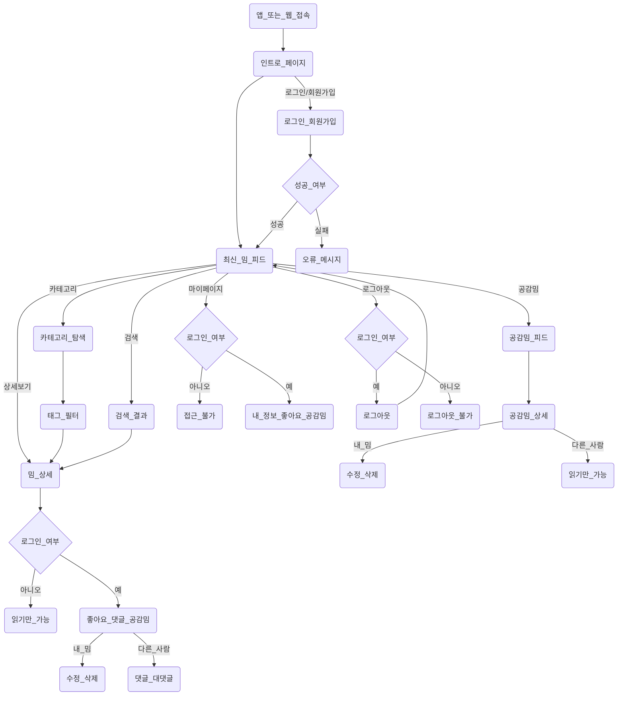

# 인싸이더(Inssider) 프로젝트

Gen-Z를 위한 최신 밈 큐레이션/소비 플랫폼

---

## 🗺️ 유저 플로우

---

## 🏁 서비스 개요

**인싸이더(Inssider)**는 유튜브 등에서 인기 있는 밈(밈 영상/짤방 등)을 자동으로 수집·분류하여, 사용자가 쉽고 빠르게 최신 트렌드를 탐색·시청·참여할 수 있도록 돕는 Gen-Z 감성의 큐레이션 플랫폼입니다.

- 매일 자동으로 인기 밈 콘텐츠를 수집/분류
- 카테고리/태그 기반 탐색, 좋아요/댓글 등 기본 인터랙션 지원
- 유튜브 기반 크로스플랫폼 피드 + 사용자 생성 공감밈 커뮤니티
- 반응형/네온&파스텔 UI, PWA 지원

---

## 🧑‍💻 주요 유저 플로우

1. **비회원/신규 유저**
   - 메인 피드에서 최신 밈/트렌드 탐색
   - 카테고리/태그 필터로 원하는 밈 찾기
   - 회원가입(이메일 인증, 닉네임 중복검사)
2. **회원**
   - 좋아요/댓글 등 인터랙션
   - 공감밈(사용자 생성 밈) 업로드 및 관리
   - 마이페이지에서 내 활동(좋아요/공감밈/프로필) 관리
3. **콘텐츠 소비/참여**
   - 밈 상세 페이지에서 영상 시청, 좋아요/댓글 작성
   - 공감밈 커뮤니티에서 직접 밈 생성/수정/삭제
   - 무한스크롤 기반 피드 탐색

---

## 🎯 핵심 기능 (MVP)

- **밈 콘텐츠 자동 수집/분류**: 유튜브 인기 밈 영상/설명/해시태그를 일정간격으로 자동 수집
- **메인 피드/카테고리/태그 필터**: 최신 트렌드, 카테고리별 탐색, 자유 태그 검색
- **좋아요/댓글/대댓글**: 로그인 유저만 가능, 중복 방지, 삭제/수정 정책 반영
- **공감밈(UGC) 커뮤니티**: 로그인 유저가 직접 밈 업로드/수정/삭제, 댓글 정책 적용
- **마이페이지**: 내 프로필, 좋아요한 밈, 내가 만든 공감밈 관리
- **반응형 UI & PWA**: 모바일 최적화, 홈화면 추가, 서비스워커/캐시 적용

---

## 🧱 기술 스택

| 범주       | 기술                               |
| ---------- | ---------------------------------- |
| 프론트엔드 | Next.js + TypeScript + TailwindCSS |
| 백엔드     | Java21, SpringBoot 4.x             |
| DB         | PostgreSQL                         |
| 인증       | 이메일 인증(회원가입), 소셜(TBD)   |
| 밈 수집    | n8n (유튜브 크롤링)                |
| 배포       | Vercel(프론트), AWS(백엔드)        |
| 기타       | PWA, Vercel Analytics, 서비스워커  |

---

## 🗺️ 개발 로드맵

| 주차    | 목표                                                      |
| ------- | --------------------------------------------------------- |
| 1주차   | 기획 확정, 기술 스택 결정, 초기 디자인                    |
| 2주차   | DB 설계, 밈 콘텐츠 검증, 데이터베이스 구축, 클라우드 배포 |
| 3주차   | 프론트 ↔ 백엔드 API 연결                                 |
| 4~6주차 | 기능 고도화 및 추가 개발                                  |

---

## 📈 MVP 성공 KPI

- [ ] 1주일 DAU 500명 이상
- [ ] 일반유저 100명 이상 가입
- [ ] 평균 페이지 체류 시간 2분 이상
- [ ] 콘텐츠 수 100건 이상 확보

---

## 🗓️ 프로젝트 마감일

**2025년 5월 12일 ~ 2025년 6월 15일**

---

## ℹ️ 부가 설명: 밈 콘텐츠 큐레이션/소비 시스템

- **큐레이션**: AI/관리자가 트렌디한 밈을 선별·분류·편집하여 제공
- **소비**: 사용자가 플랫폼에서 밈을 시청·좋아요·댓글 등으로 즐기고 참여
- **공감밈**: 사용자가 직접 밈을 올리고, 커뮤니티 내에서 소통

---

> 본 프로젝트는 Gen-Z 세대를 위한 최신 밈 트렌드 큐레이션/참여 경험을 목표로 하며, MVP 기준으로 핵심 기능에 집중합니다.
